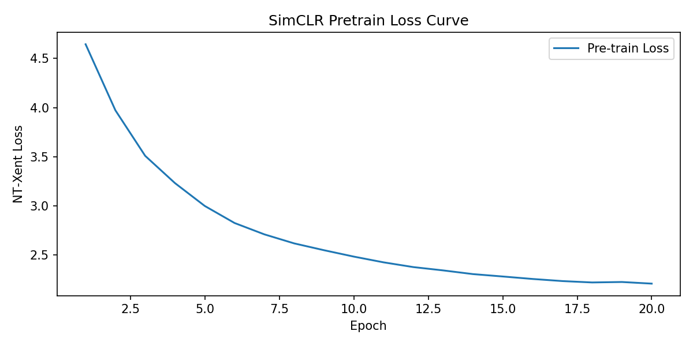
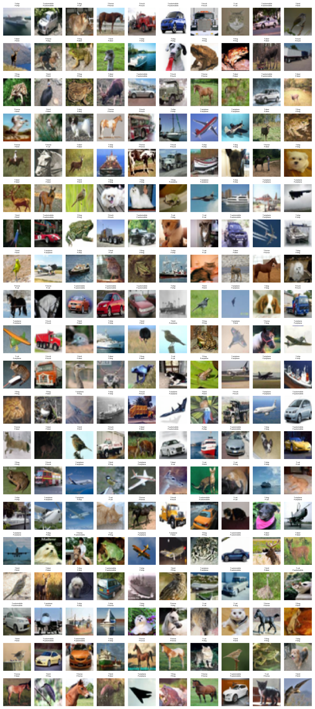

# Mini-SimCLR 图像表征学习复现实验报告

## 1. 论文信息

- 论文名称：A Simple Framework for Contrastive Learning of Visual Representations
- 论文地址：https://arxiv.org/abs/2002.05709
- 官方代码参考：https://github.com/google-research/simclr

## 2. 任务说明

本实验复现的任务是自监督图像表征学习。

```text
预训练输入：无标签图像
预训练目标：让同一图像的两种增强视图在表征空间中更接近，让不同图像的表征更远
评估方式：冻结 encoder，训练 linear probe，报告 CIFAR-10 分类准确率
```

## 3. 数据集

- 数据集名称：CIFAR-10
- 数据集地址：https://www.cs.toronto.edu/~kriz/cifar.html
- 实际使用预训练图像数：50,000
- 实际使用 linear probe 训练图像数：50,000
- 实际使用测试图像数：10,000
- 使用设备：GPU（CUDA）
- 总训练耗时：5,546.05 s（约 92.4 分钟）

## 4. 数据增强

请说明自己使用的增强策略：

| 增强方法 | 参数设置 |
|---|---|
| RandomResizedCrop | size=32，scale=(0.2, 1.0) |
| RandomHorizontalFlip | p=0.5 |
| ColorJitter | brightness=0.4, contrast=0.4, saturation=0.4, hue=0.1，应用概率 0.8 |
| RandomGrayscale | p=0.2 |
| GaussianBlur | kernel_size=3，sigma=(0.1, 2.0) |

请说明为什么这些增强适合 SimCLR：

```text
这些增强在保留图像语义类别信息的同时，显著改变了图像的低层外观（颜色、纹理、位置、尺度等）。
SimCLR 要求同一图像的两个增强视图在表征空间中足够接近，因此模型必须忽略这些低层变化、
抓住真正决定类别的语义特征，从而学到有区分力的表示。
同时，随机裁剪缩放 + 色彩抖动 + 灰度的组合能有效防止模型走"捷径"（例如仅靠颜色分布或
纹理来区分样本），是 SimCLR 论文中证明最有效的增强组合。
```

## 5. 模型结构

请说明自己的 Mini-SimCLR 结构：

```text
Image -> Two Augmented Views -> Shared Encoder -> Projection Head -> NT-Xent Loss
```

### 5.1 Encoder

- encoder 类型：ResNet-18（针对 CIFAR-10 的 32×32 输入做了适配：conv1 改为 3×3、stride=1、padding=1；移除 maxpool；移除 fc 层）
- 输出特征维度：512
- 是否使用预训练权重：否（pretrained=False，从头自监督训练）

### 5.2 Projection Head

- MLP 层数：2 层（Linear → ReLU → Linear）
- hidden dimension：512
- output dimension：128
- 是否使用 ReLU / BatchNorm：使用 ReLU（第一层之后）；未使用 BatchNorm

### 5.3 Linear Probe

- encoder 是否冻结：是（`requires_grad_(False)`）
- linear classifier 输入维度：512
- 类别数：10

## 6. Loss 实现

请说明 NT-Xent loss 的实现方式：

- batch size：128（拼接两个增强视图后共 2N = 256）
- `2N` 个增强样本如何构造：每张图经 `TwoCropTransform` 生成两个视图 view1/view2，再沿 batch 维 `torch.cat([view1, view2], dim=0)` 得到 [2N, D]
- 正样本索引如何确定：对第 i 个视图（0 ≤ i < N），其正样本是 i+N（同一原图的另一视图）；对第 i+N 个视图，正样本是 i
- temperature：0.2
- logits shape：(2N, 2N-1)，其中第 1 列为正样本 logit，后 2N-2 列为负样本 logit，label 全为 0（正样本在第 0 位）

关键代码片段：

```python
def nt_xent_loss(z, temperature=0.5):
    batch_2 = z.shape[0]; B = batch_2 // 2
    sim = torch.matmul(z, z.T) / temperature                 # [2N, 2N] 相似度
    mask = torch.eye(batch_2, dtype=torch.bool, device=z.device)
    sim_no_self = sim[~mask].view(batch_2, batch_2 - 1)      # 去掉对角线(自身)
    # 正样本对
    pos_list = []
    for i in range(B):
        pos_list.append(sim[i, i+B]); pos_list.append(sim[i+B, i])
    pos_sim = torch.stack(pos_list).unsqueeze(1)
    # 负样本：去掉自身 + 正样本
    neg_mask = torch.ones_like(sim, dtype=torch.bool)
    neg_mask.fill_diagonal_(False)
    for i in range(B):
        neg_mask[i, i+B] = False; neg_mask[i+B, i] = False
    neg_sim = sim[neg_mask].view(batch_2, batch_2 - 2)
    logits = torch.cat([pos_sim, neg_sim], dim=1)            # [2N, 2N-1]
    labels = torch.zeros(logits.shape[0], dtype=torch.long, device=z.device)
    return F.cross_entropy(logits, labels)
```

## 7. 训练设置

### 7.1 自监督预训练

| 配置 | 数值 |
|---|---:|
| train images | 50,000 |
| epochs | 20 |
| batch size | 128 |
| optimizer | Adam |
| learning rate | 3×10⁻³（CosineAnnealingLR，eta_min=1×10⁻⁵） |
| temperature | 0.2 |
| encoder | ResNet-18 |
| device | GPU（CUDA） |

### 7.2 Linear Probe

| 配置 | 数值 |
|---|---:|
| train images | 50,000 |
| test images | 10,000 |
| epochs | 20 |
| batch size | 128 |
| optimizer | Adam |
| learning rate | 3×10⁻³（CosineAnnealingLR，eta_min=1×10⁻⁵） |
| device | GPU（CUDA） |

## 8. 训练过程

粘贴 contrastive loss 日志或 loss 曲线。

| Epoch | Contrastive Loss |
|---|---:|
| 1 | 4.645 |
| 5 | 3.000 |
| 10 | 2.485 |
| 15 | 2.283 |
| 20 | 2.210 |



请简要描述 loss 是否下降，以及训练是否稳定：

```text
NT-Xent 损失从第 1 个 epoch 的 4.645 单调下降到第 20 个 epoch 的 2.210，
全程无震荡、无发散，下降平稳。虽然到第 20 个 epoch 时损失仍在缓慢下降（未完全饱和），
但整体已进入收敛区间，说明模型正在持续学到更好的表征。
```

## 9. Linear Probe 结果

| 指标 | 结果 |
|---|---:|
| test accuracy | 71.89% |
| random baseline | 10% |

请分析结果是否明显高于随机猜测：

```text
是。linear probe 在测试集上达到 71.89% 的准确率，而 10 类随机猜测的基线仅为 10%，
说明预训练阶段在没有使用任何标签的情况下，encoder 已经学到了具有判别力的语义特征。
与随机初始化（约 10%）相比提升了 6 倍以上，验证了 SimCLR 自监督对比学习的有效性。
```

## 10. 预测结果展示

至少展示 3 个测试样例。



| 图片编号 | 真实类别 | 预测类别 | 是否正确 |
|---|---|---|---|
| 1 | cat | cat | 是 |
| 2 | ship | ship | 是 |
| 3 | ship | automobile | 否 |

## 11. 问题与改进

请简要说明：

- 遇到了哪些问题；
- 最终如何解决；
- 如果继续改进，可以从哪些方面入手，例如 batch size、epoch、temperature、projection head、数据增强等。

```text
【遇到的问题与解决】
1. CIFAR-10 是 32×32 小图，ResNet-18 原本面向 224×224 的 ImageNet。直接使用会导致
   特征图过小。解决：把 conv1 改为 3×3、stride=1、padding=1，并移除 maxpool 与 fc 层，
   使 32×32 输入在 encoder 末端仍能保留 512 维特征。
2. NT-Xent 损失需要正确区分正/负样本对，若索引构造错误会出现损失不下降或发散。
   解决：先去掉自身对角线，再按 i↔i+B 提取正样本对、其余为负样本，用交叉熵实现。

【可改进方向】
1. 增大 batch size：SimCLR 原文用 4096，负样本更多、对比更强，这里仅 128，是主要瓶颈。
2. 增加 epoch：第 20 个 epoch 损失仍在下降，训练未完全饱和。
3. 尝试不同 temperature（如 0.1 / 0.5）与 projection head 维度（如 256 / 512）。
4. 用更深的 encoder（ResNet-50 等）提升表征容量。
5. 引入更强增广（如更激进的颜色抖动、更大的随机裁剪尺度范围）。
```


## 12. Git 提交记录

- 仓库地址：https://github.com/jcj12343/simclr
- 总 commit 数：4

粘贴 `git log --oneline` 输出：

```text
01bf365 Add SimCLR experiment report
6bacce2 Merge remote-tracking branch 'origin/main'
41b9fa1 Initial commit
5f728fa Initial commit: SimCLR self-supervised learning (pretrain + linear probe)
```
